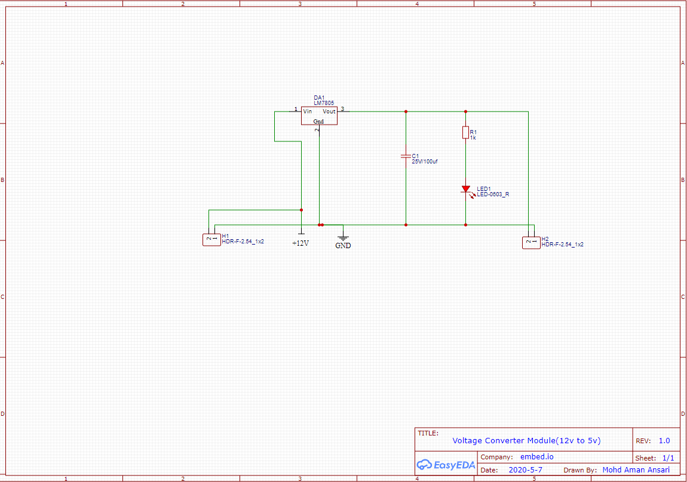
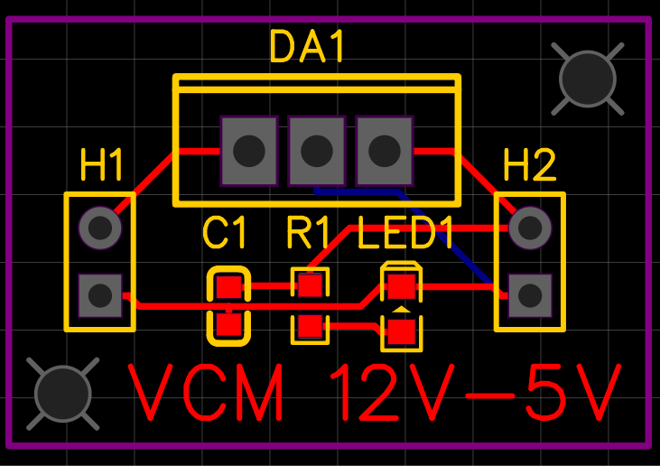
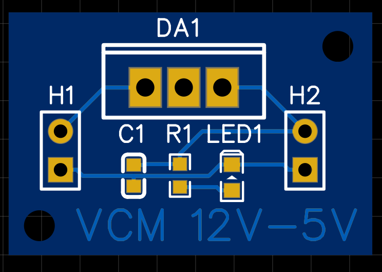
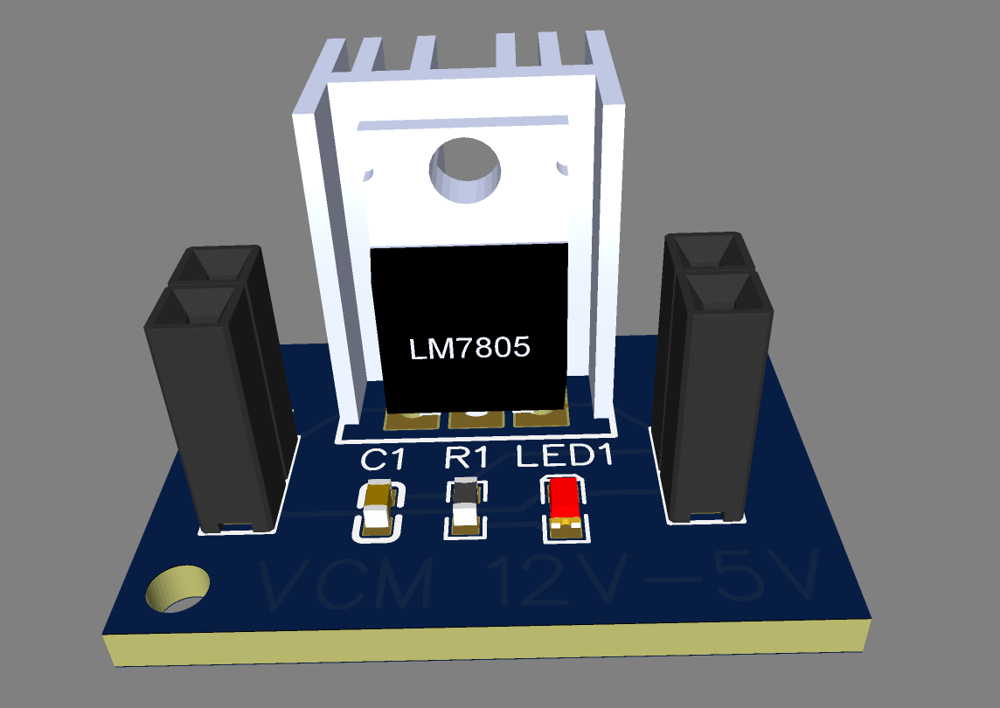

#  12V DC to 5V DC Voltage converter

In this circuitary 12V DC power supply is converted into 5V DC regulated supply. 
In this we are used the tool for designing schematic and PCB is "EASY EDA" which is open source.

### Circuit diagram or schematic

### PCB

### 2D view

### 3D view

